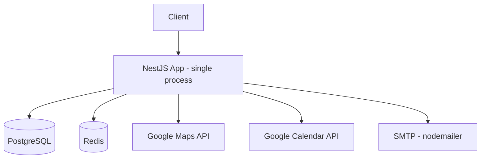
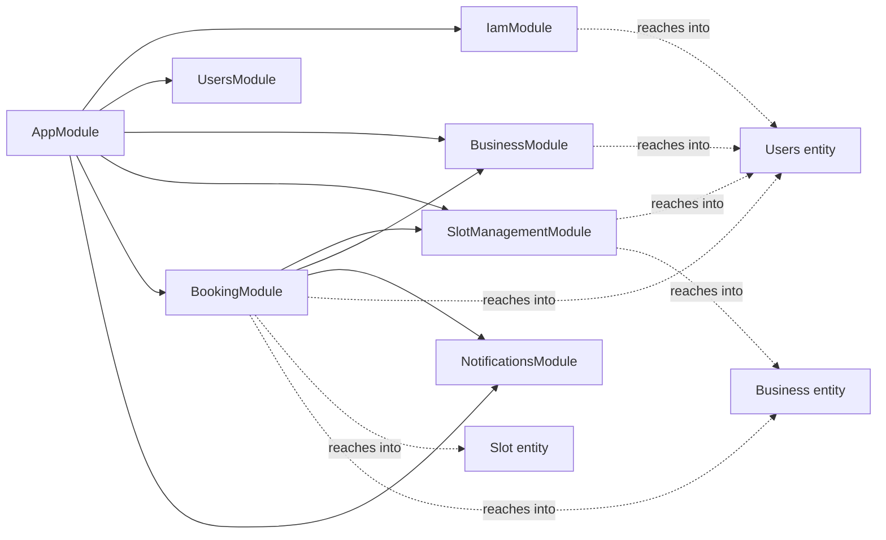
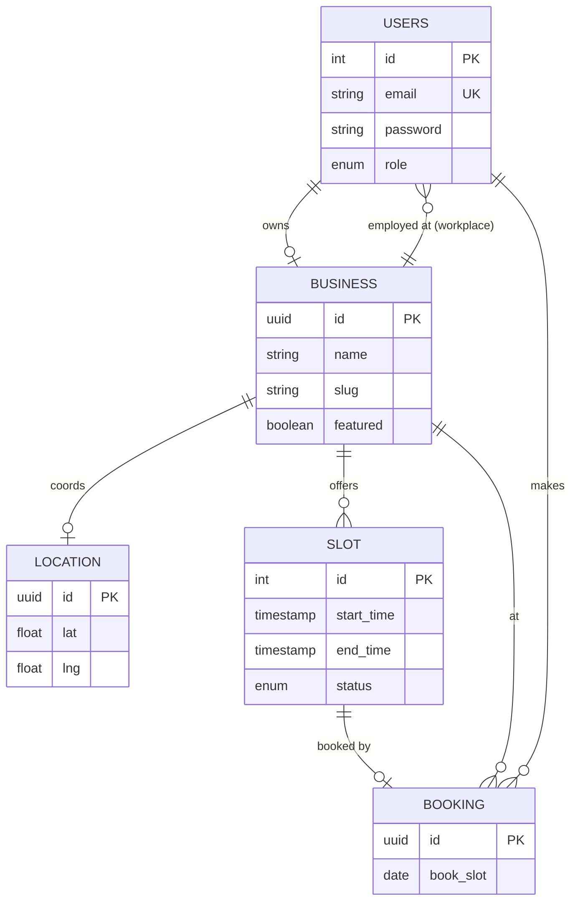
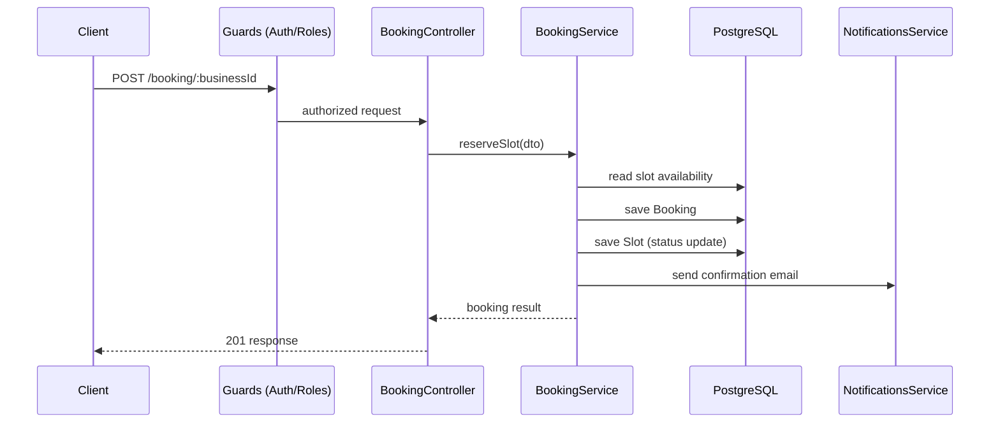

# Architecture

## Overview

Smart Booking is a feature-based modular monolith built on NestJS. A single Express-backed process serves a REST API backed by PostgreSQL (via TypeORM) and Redis (refresh-token storage). It integrates with Google Calendar, Google Maps, and SMTP for outbound email.

## Tech stack

| Concern | Choice |
|---|---|
| Framework | NestJS 11 (Express platform) |
| Language | TypeScript |
| Database | PostgreSQL, via TypeORM 0.3 |
| Cache / ephemeral store | Redis (ioredis) — refresh-token id storage |
| Auth | JWT (access + refresh tokens), bcrypt password hashing |
| Validation | class-validator / class-transformer |
| API docs | @nestjs/swagger, served at `/docs` |
| External APIs | Google Calendar, Google Maps Geocoding |
| Email | nodemailer over SMTP |
| Migrations | TypeORM CLI, `synchronize: false` |

## Module map

Solid arrows are proper module dependencies (`imports: [...]`, using the target module's exported service). Dashed arrows are the module registering `TypeOrmModule.forFeature` directly on an entity it doesn't own, bypassing the owning module's service — see [Known issues](#known-issues-tracked-in-roadmapmd).

| Module | Owns entities | Exports |
|---|---|---|
| `IamModule` | — (reaches into `Users`) | Global `AuthenticationGuard` + `RolesGuard` via `APP_GUARD`; `AuthenticationController` |
| `UsersModule` | `Users` | `UsersService` (not currently consumed by `IamModule`) |
| `BusinessModule` | `Business`, `Location` | `BusinessService` |
| `SlotManagementModule` | `Slot` | `SlotManagementService` |
| `BookingModule` | `Booking` | `BookingService` |
| `NotificationsModule` | — | `NotificationsService` (email) |

## Data model

`Business.owner`, `Business.employees`, and `Business.slots` are currently all `eager: true` — every `Business` fetch anywhere in the app implicitly loads the owner, every employee, and every slot the business has ever had. Tracked as a fix in `ROADMAP.md` (Phase 1/3).

## API surface

| Module | Route | Auth |
|---|---|---|
| Authentication | `POST /authentication/sign-up` | Public |
| Authentication | `POST /authentication/sign-in` | Public |
| Authentication | `POST /authentication/refresh-tokens` | Public (refresh token) |
| Users | `GET /users`, `GET /users/:id`, `PATCH /users/:id` | Authenticated |
| Business | `POST /business/open` | Authenticated |
| Business | `GET /business`, `GET /business/:slug`, `PATCH /business/:slug` | Mixed |
| Slot management | `POST /slots/daily`, `POST /slots/weekly`, `GET /slots`, `GET /slots/:date`, `PATCH /slots/:date`, `DELETE /slots/:date`, `POST /slots/report` | Business/Employee/Admin |
| Booking | `POST /booking/:businessId`, `GET /booking/business/:businessId`, `GET /booking/slot/:id`, `DELETE /booking/slot/:id`, `GET /booking/slots/` | Authenticated |

Auth is enforced globally by default (`APP_GUARD` chain: `AuthenticationGuard` → `RolesGuard`); routes opt out via the `@Auth(AuthType.None)` decorator rather than opting in, which is the safer default.

## Request flow — booking a slot

The slot read and the two writes are not currently wrapped in a transaction or row lock — see the double-booking race condition in `ROADMAP.md` (Phase 1).

## Known issues

Tracked and prioritized in [`ROADMAP.md`](./ROADMAP.md), from the 2026-08-26 backend + architecture review. Summary of the structural items:

- Module boundaries not respected — several modules register repositories for entities they don't own instead of depending on the owning module's service.
- Unbounded eager loading on `Business` (owner, employees, all slots) on every fetch.
- No DB-level uniqueness backing slot↔booking, so double-booking protection lives entirely in application code.
- No config validation schema at boot.
- A few entity typing/relation-wiring bugs (`Booking.id` typed `number` but is a UUID string, `Location.business_id` mistyped, `Slot.booking_by` inverse side wired incorrectly).
