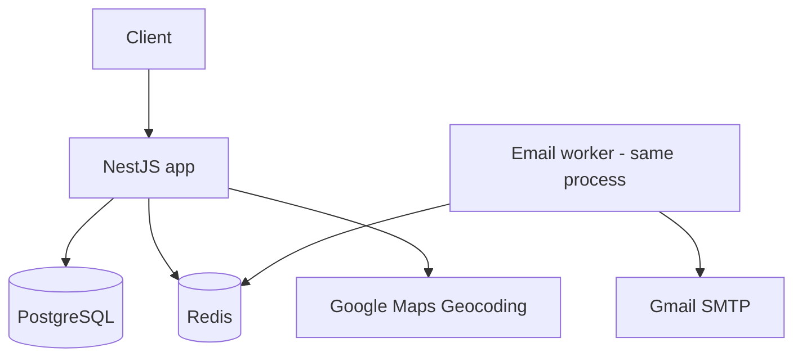
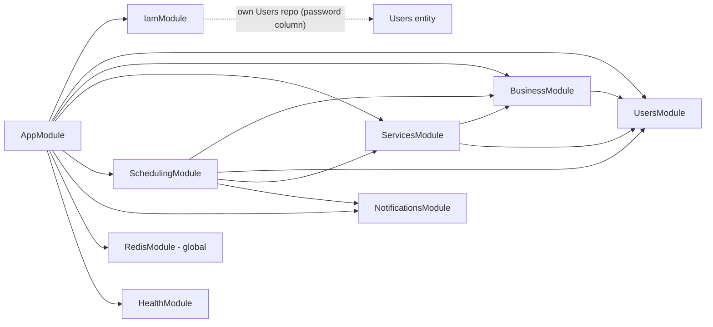
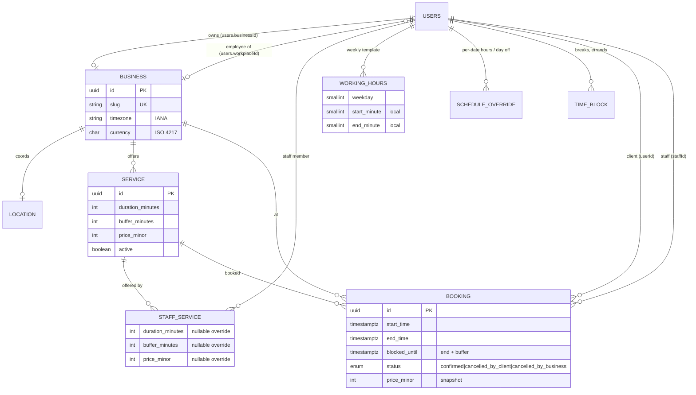

# Architecture

## Overview

Smart Booking is a feature-based modular monolith built on NestJS. A single Express-backed process serves a REST API on PostgreSQL (TypeORM) and Redis. Redis holds refresh-token sessions and rate-limit counters, and backs the BullMQ email queue. The app calls Google Maps (geocoding) and sends email over Gmail SMTP from a queue worker in the same process.



## Tech stack

| Concern | Choice |
|---|---|
| Framework | NestJS 11 (Express platform) |
| Language | TypeScript, `strict` (except `strictPropertyInitialization`) |
| Database | PostgreSQL 15 via TypeORM 0.3, migrations in `src/migrations`, `synchronize: false` |
| Redis | ioredis: refresh sessions, `@nestjs/throttler` storage, BullMQ |
| Auth | JWT access + refresh tokens (typed `access`/`refresh`), bcrypt |
| Time zones | `@date-fns/tz`; all instants stored as `timestamptz` |
| Double-booking guard | Postgres exclusion constraint (`btree_gist`) on staff + time range |
| Validation / output | class-validator on input; `@Serialize(Dto)` response DTOs on output |
| API docs | Swagger at `/docs` (off in production unless `SWAGGER_ENABLED`) |
| Ops | `/health` (terminus: pg + redis), helmet, configurable CORS, Docker, GitHub Actions CI |

## Module map



Each entity has exactly one owning module that registers `TypeOrmModule.forFeature` for it; other modules go through that module's exported service. The one deliberate exception is `IamModule`, which keeps its own `Users` repository. It needs the `select: false` password column and the current role (`RolesGuard`), and that access shouldn't be exposed app-wide.

| Module | Owns | Provides |
|---|---|---|
| `IamModule` | — | Global `AuthenticationGuard` + `RolesGuard`; sign-up/in, refresh, logout; refresh-session storage |
| `UsersModule` | `Users` | `UsersService` (`findActiveUser(sub)`, `findStaffMember`) |
| `BusinessModule` | `Business`, `Location` | `BusinessService`, `GeocodingService` (stubbable), `StaffAccessService` (who acts for which business and staff member) |
| `ServicesModule` | `Service`, `StaffService` | Service catalog (owner), public service list, effective per-staff terms |
| `SchedulingModule` | `WorkingHours`, `ScheduleOverride`, `TimeBlock`, `Booking` | `ScheduleService` (hours, overrides, blocks), `AvailabilityService` + pure `availability.ts`, `BookingService` |
| `NotificationsModule` | — | `NotificationsService` (enqueue), `NotificationsProcessor` + `EmailSender` (worker) |
| `RedisModule` | — | Shared `REDIS_CLIENT` |
| `HealthModule` | — | `GET /health` |

`SchedulingModule` is deliberately one module: blocks may not overlap bookings, availability subtracts bookings and blocks, and bookings are validated against availability. Split into separate modules, they would depend on each other in a cycle.

## Data model



`booking` carries an exclusion constraint: no two `confirmed` rows for the same `staffId` may have overlapping `[start_time, blocked_until)`.

## Key design decisions

**Time.** Every instant is a UTC `timestamptz`. Working hours are minutes since local midnight and calendar days are `yyyy-MM-dd`, both interpreted in the business's IANA timezone (`src/common/time.ts`), so 09:00 stays 09:00 local across DST changes. A time without an offset is local business time; with an offset it is absolute. Nothing depends on the server's timezone (the suites pass under `TZ=Pacific/Auckland`).

**Availability is computed, never stored.** `availability.ts` is a pure function: for a day, a staff member's working intervals (the date's override, or else the weekly template) minus blocks and bookings (including their buffers), it returns start times on a 15-minute local grid where the service fits. The service must end within working hours; its buffer only has to stay clear of other bookings and blocks. Changing hours, adding a break or cancelling takes effect immediately, with nothing to regenerate.

**Tenancy and access.** The caller is always resolved from the JWT `sub`, never from mutable claims. `StaffAccessService` resolves the business the caller manages: the one they own, or an employee's workplace. Owners may act on any staff member of their business (`staffId`) and manage the service catalog; employees only on their own schedule. Admins have no implicit cross-business access. `RolesGuard` checks the user's current role from the database.

**Auth.** Access and refresh tokens share a key but carry a `type` claim that the guard and the refresh endpoint enforce. Each sign-in creates a Redis session `refresh:<user>:<tokenId>` that expires with the token; refresh rotates it and logout deletes it. `/authentication/*` has its own stricter rate limit.

**Consistency.** A booking is re-validated against current availability, then inserted in a transaction that takes a per-staff advisory lock. The Postgres exclusion constraint on `(staffId, tstzrange(start_time, blocked_until))` is the real guarantee: overlapping bookings of any length can't exist, whatever the app does (covered by an e2e test that inserts directly). The advisory lock only prevents deadlocks between concurrent overlapping inserts. Five simultaneous requests for one time produce exactly one 201. Bookings keep a snapshot of duration, price and currency, so catalog edits don't rewrite history.

**Output.** Handlers may return entities, but every data-returning endpoint is wrapped in `@Serialize(Dto)` with `excludeExtraneousValues`, so only whitelisted fields leave the API.

## Request flow — booking an appointment

```mermaid
sequenceDiagram
    participant C as Client app
    participant BS as BookingService
    participant AV as availability (pure)
    participant DB as PostgreSQL
    participant Q as BullMQ (Redis)

    C->>BS: GET /booking/business/:id/availability?serviceId&from
    BS->>DB: hours, overrides, blocks, bookings
    BS->>AV: compute starts (15-min grid, duration + buffer)
    BS-->>C: [{start, end, staffId, price_minor}]
    C->>BS: POST /booking/:businessId {serviceId, start, staffId?}
    BS->>AV: is start still free? which staff?
    BS->>DB: BEGIN; pg_advisory_xact_lock(staff); INSERT booking; COMMIT
    Note over DB: exclusion constraint rejects any overlap
    BS->>Q: enqueue emails
    BS-->>C: 201 booking
```

## Testing

- **Unit** (`src/**/*.spec.ts`, no infrastructure): availability math (grid, buffers, blocks, split shifts, DST), time helpers, access rules, auth guard, business creation, notifications.
- **e2e** (`test/*.e2e-spec.ts`): the real `AppModule` against a dedicated database rebuilt from migrations and a separate Redis DB. Google Maps and SMTP are stubbed. Covers token misuse, sessions, throttling, tenant isolation, concurrent booking, the database-level overlap guarantee, buffers, hours/overrides/blocks, staff rules, timezones and response shapes.

## Open work

See [`ROADMAP.md`](./ROADMAP.md). The main architectural items left: owner endpoints to manage employees (E1), business-side cancellation rules (F2), notification channels beyond email (G7), a versioned mobile API (G8), subscriptions (G9), AI-designed business pages (G11), and a DB outbox if email delivery ever needs to survive a crash between commit and enqueue.
