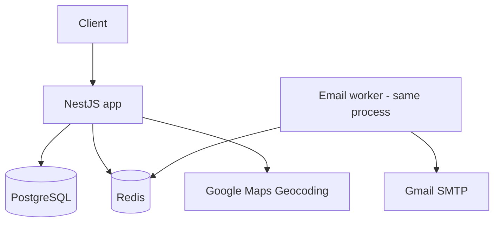
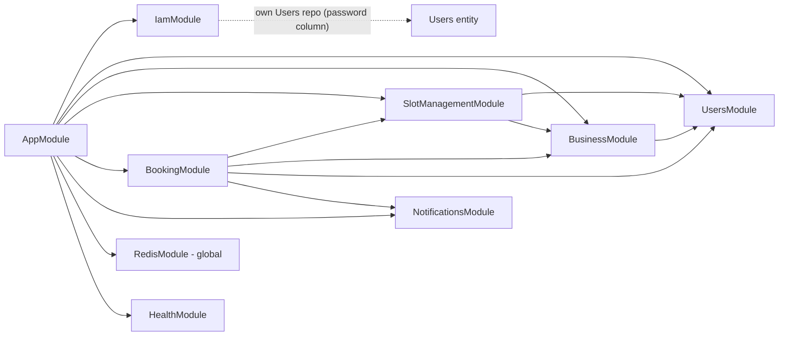
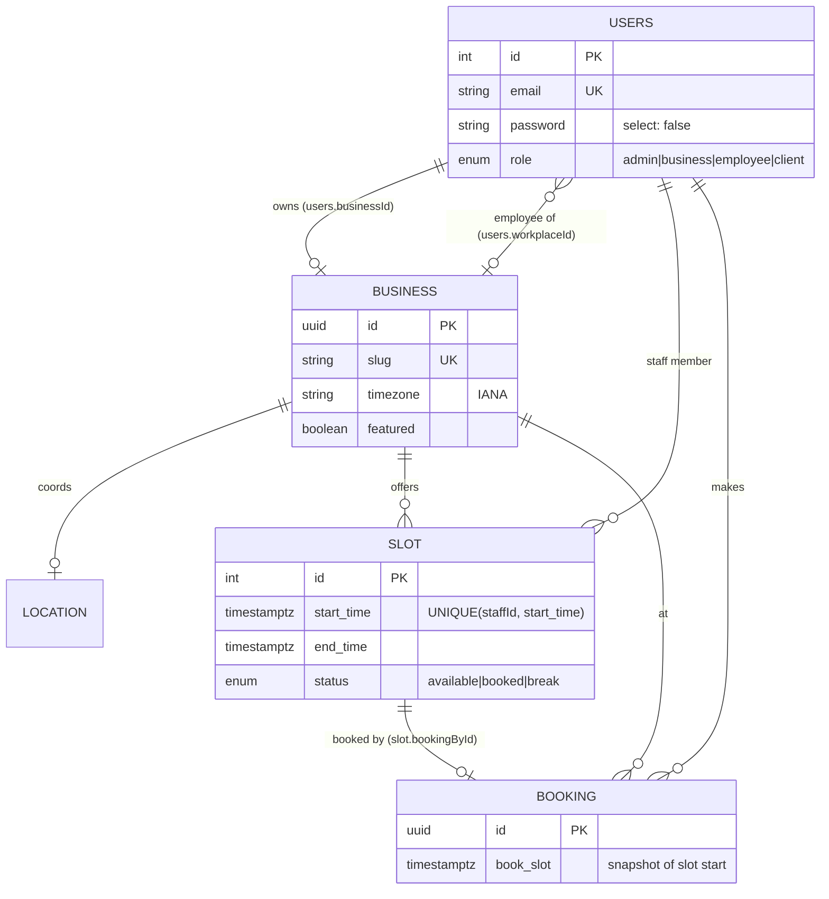

# Architecture

## Overview

Smart Booking is a feature-based modular monolith built on NestJS. A single Express-backed process serves a REST API on PostgreSQL (TypeORM) and Redis. Redis holds refresh-token sessions and rate-limit counters, and backs the BullMQ email queue. The app calls Google Maps (geocoding) and sends email over Gmail SMTP from a queue worker in the same process.



## Tech stack

| Concern | Choice |
|---|---|
| Framework | NestJS 11 (Express platform) |
| Language | TypeScript, `strict` (except `strictPropertyInitialization`) |
| Database | PostgreSQL 15 via TypeORM 0.3, migrations in `src/migrations`, `synchronize: false` |
| Redis | ioredis: refresh sessions, `@nestjs/throttler` storage, BullMQ |
| Auth | JWT access + refresh tokens (typed `access`/`refresh`), bcrypt |
| Time zones | `@date-fns/tz`; all instants stored as `timestamptz` |
| Validation / output | class-validator on input; `@Serialize(Dto)` response DTOs on output |
| API docs | Swagger at `/docs` (off in production unless `SWAGGER_ENABLED`) |
| Ops | `/health` (terminus: pg + redis), helmet, configurable CORS, Docker, GitHub Actions CI |

## Module map



Each entity has exactly one owning module that registers `TypeOrmModule.forFeature` for it; other modules go through that module's exported service. The one deliberate exception is `IamModule`, which keeps its own `Users` repository. It needs the `select: false` password column and the current role (`RolesGuard`), and that access shouldn't be exposed app-wide.

| Module | Owns | Provides |
|---|---|---|
| `IamModule` | — | Global `AuthenticationGuard` + `RolesGuard`; sign-up/in, refresh, logout; refresh-session storage |
| `UsersModule` | `Users` | `UsersService` (`findActiveUser(sub)`, `findStaffMember`) |
| `BusinessModule` | `Business`, `Location` | `BusinessService`, `GeocodingService` (Google Maps behind a stubbable interface) |
| `SlotManagementModule` | `Slot` | `SlotAccessService` (who manages what), `SlotCommandService` (writes), `SlotQueryService` (reads), pure `slot-schedule.ts` |
| `BookingModule` | `Booking` | `BookingService` |
| `NotificationsModule` | — | `NotificationsService` (enqueue), `NotificationsProcessor` + `EmailSender` (worker) |
| `RedisModule` | — | Shared `REDIS_CLIENT` |
| `HealthModule` | — | `GET /health` |

## Data model



## Key design decisions

**Time.** Every instant is a UTC `timestamptz`. Working hours and calendar days (`yyyy-MM-dd`) are interpreted in the business's IANA timezone by the pure functions in `slot-schedule.ts`. Each slot's start and end are computed as local wall-clock times, so opening hours stay put across DST changes. A booking time without an offset is local business time; with an offset it is absolute. Nothing depends on the server's timezone (the suites pass under `TZ=Pacific/Auckland`).

**Tenancy and access.** The caller is always resolved from the JWT `sub`, never from mutable claims. `SlotAccessService` resolves the business the caller manages: the one they own, or an employee's workplace. Owners may act on any staff member of their business (`staffId`); employees only on their own slots. Admins have no implicit cross-business access. `RolesGuard` checks the user's current role from the database.

**Auth.** Access and refresh tokens share a key but carry a `type` claim that the guard and the refresh endpoint enforce. Each sign-in creates a Redis session `refresh:<user>:<tokenId>` that expires with the token; refresh rotates it and logout deletes it. `/authentication/*` has its own stricter rate limit.

**Consistency.** A reservation locks candidate slot rows (`SELECT … FOR UPDATE`) inside a transaction, so concurrent requests for one slot get exactly one success (covered by an e2e test). Slot generation, rescheduling, cancellation and business creation are each a single transaction.

**Output.** Handlers may return entities, but every data-returning endpoint is wrapped in `@Serialize(Dto)` with `excludeExtraneousValues`, so only whitelisted fields leave the API.

## Request flow — booking a slot

```mermaid
sequenceDiagram
    participant C as Client
    participant G as Throttler / Auth / Roles guards
    participant BS as BookingService
    participant DB as PostgreSQL
    participant Q as BullMQ (Redis)
    participant W as Email worker

    C->>G: POST /booking/:businessId {reserveSlot, staffId?}
    G->>BS: authorized request
    BS->>BS: parse time in business timezone
    BS->>DB: BEGIN; SELECT slot … FOR UPDATE
    BS->>DB: INSERT booking; UPDATE slot SET status='booked'; COMMIT
    BS->>Q: enqueue 2 emails
    BS-->>C: 201 {id, book_slot}
    W->>Q: take job
    W->>W: send via SMTP (retries with backoff)
```

## Testing

- **Unit** (`src/**/*.spec.ts`, no infrastructure): schedule math including DST, access rules, auth guard, business creation, notifications.
- **e2e** (`test/*.e2e-spec.ts`): the real `AppModule` against a dedicated database rebuilt from migrations and a separate Redis DB. Google Maps and SMTP are stubbed. Covers token misuse, sessions, throttling, tenant isolation, concurrency, timezones, staff rules and response shapes.

## Open work

See [`ROADMAP.md`](./ROADMAP.md). The main architectural items left: owner endpoints to manage employees (E1), booking history with the slot↔booking FK moved to the booking side (F2 + C4), and a DB outbox if email delivery ever needs to survive a crash between commit and enqueue.
